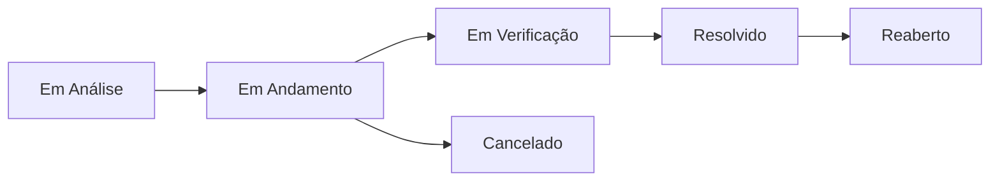

<div align="center">

# 🏙️ Terraurb

[](https://opensource.org/licenses/MIT)
[](https://nodejs.org/)
[](https://expressjs.com/)
[](https://www.mysql.com/)
[](https://sequelize.org/)

> 🌿 Uma plataforma poderosa para gerenciar e reportar terrenos urbanos abandonados

</div>

## 📋 Sumário

- [Visão Geral](#-overview)
- [Funcionalidades](#-features)
- [Arquitetura do Sistema](#-system-architecture)
- [Começando](#-getting-started)
- [Documentação da API](#-api-documentation)
- [Esquema do Banco de Dados](#-database-schema)
- [Segurança](#-security)

## 🎯 Visão Geral

Terraurb é uma plataforma especializada projetada para facilitar o gerenciamento de denúncias de terrenos urbanos abandonados. Ela permite que os cidadãos reportem propriedades negligenciadas em sua cidade, fornecendo às autoridades municipais ferramentas para acompanhar e resolver esses casos de forma eficiente.

## ✨ Funcionalidades

### 👥 Papéis de Usuário

- **Administrador** (`admin`)
  - Acesso completo ao sistema
  - Gerenciamento de usuários
  - Moderação de conteúdo

- **Funcionário da Prefeitura** (`city_hall`)
  - Gerenciamento de denúncias
  - Atualizações de status

- **Usuário Regular** (`regular`)
  - Enviar denúncias
  - Adicionar comentários
  - Reportar conteúdo inadequado

### 📝 Gerenciamento de Denúncias

**Fluxo de Status:**


### 🏷️ Sistema de Tags

As denúncias podem ser categorizadas com tags como:
- 🌱 Mato alto
- 🗑️ Lixo acumulado
- ⚠️ Risco à saúde

## 🏗️ Arquitetura do Sistema

### Stack Tecnológica

- **Backend:** Node.js + Express.js
- **Banco de Dados:** MySQL
- **ORM:** Sequelize
- **Autenticação:** JWT
- **Documentação:** Swagger/OpenAPI

## 🚀 Começando

### Pré-requisitos

- Node.js (v14 ou superior)
- MySQL (v8.0 ou superior)

### Instalação

1. Clone o repositório
```bash
git clone https://github.com/yourusername/terraurb.git
cd terraurb
```

2. Instale as dependências
```bash
npm install
```

3. Configure as variáveis de ambiente
```bash
cp .env.example .env
# Edite o arquivo .env com suas credenciais do banco de dados e chave JWT
```

4. Execute as migrações do banco de dados
```bash
npm run migrate
```

5. Inicie o servidor
```bash
npm start
```

## 📚 Documentação da API

### Endpoints de Autenticação

| Método | Endpoint | Descrição |
|--------|----------|------------|
| POST | `/api/auth/register` | Criar nova conta de usuário |
| POST | `/api/auth/login` | Autenticar usuário |
| GET | `/api/auth/me` | Obter perfil do usuário atual |

### Endpoints de Denúncias

| Método | Endpoint | Descrição |
|--------|----------|------------|
| GET | `/api/complaints` | Listar todas as denúncias |
| POST | `/api/complaints` | Criar nova denúncia |
| GET | `/api/complaints/:id` | Obter detalhes da denúncia |
| PATCH | `/api/complaints/:id/status` | Atualizar status da denúncia |

## 💾 Esquema do Banco de Dados

### Tabelas Principais

- **Users**
  - Informações e autenticação do usuário

- **Complaints**
  - Registros e status das denúncias

- **ComplaintLogs**
  - Histórico de alterações de status

- **Comments**
  - Comentários dos usuários nas denúncias

- **Tags**
  - Tags de categorização

- **Reports**
  - Relatórios de moderação de conteúdo

## 🔒 Segurança

- Autenticação baseada em JWT
- Criptografia de senha com bcrypt
- Controle de acesso baseado em papéis
- Middleware de validação de requisições
- Endpoints de API protegidos

## 🤝 Contribuindo

Contribuições são bem-vindas! Sinta-se à vontade para enviar um Pull Request.

## 📄 Licença

Este projeto está licenciado sob a Licença MIT - veja o arquivo [LICENSE](LICENSE) para detalhes.

---

<div align="center">

🌿 **Terraurb** - Tornando as cidades mais limpas e seguras, um terreno por vez.

</div>